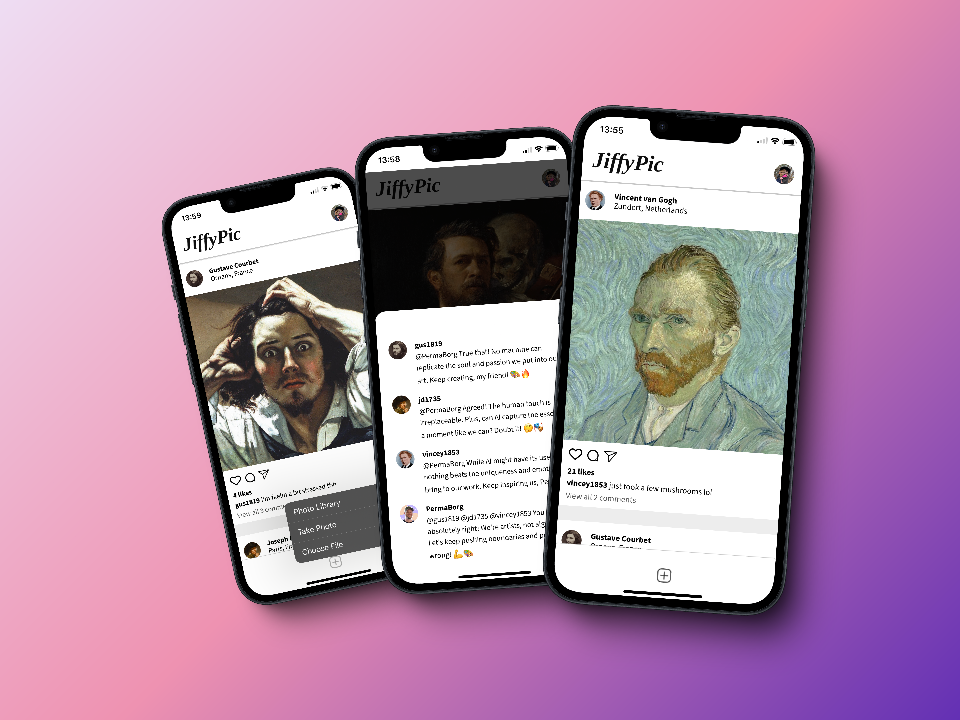
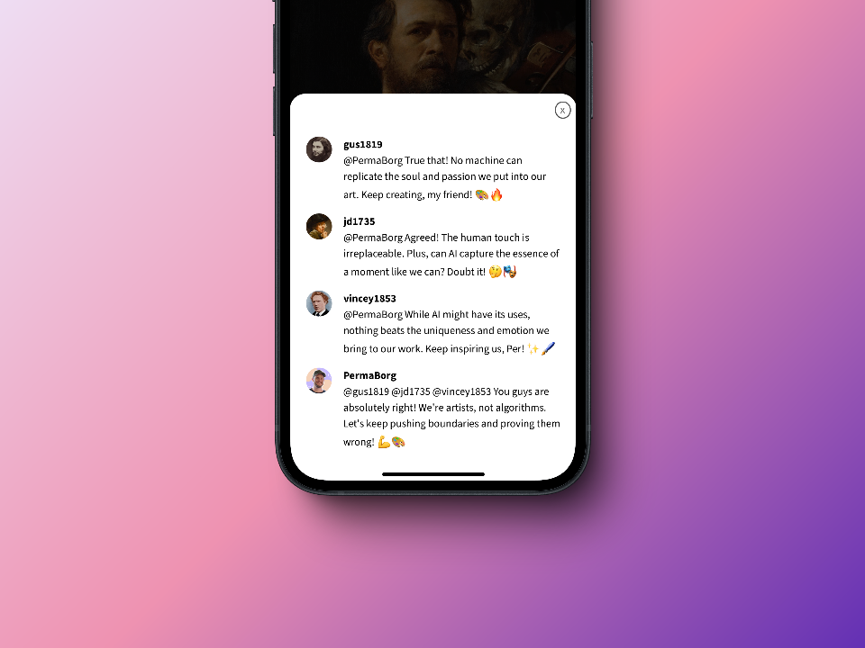

# JiffyPic - Solo Project

## *Overview* 🧐
This project is part of the **"Essential CSS Concepts"** module from the [**Frontend Career Path**](https://v2.scrimba.com/the-frontend-developer-career-path-c0j) course on [**Scrimba**](https://v2.scrimba.com/home).

JiffyPic simulates a social media platform where users can view posts with photos, comments, and likes. Semantic HTML, interactive CSS effects, and JavaScript were used to dynamically render the posts.

## *Requirements* 📝

✅ ~~Create the first post.~~

✅ ~~Use semantic HTML.~~

✅ ~~Add hover effects to the icons.~~

## *Stretch goals* 💪

✅ ~~Use JavaScript to render out all three posts.~~

✅ ~~Increase the likes when double clicking the post.~~

## *Going above and beyond* 🚀

✅ ~~Fixed-position menu bar.~~

✅ ~~Ability to view comments.~~

✅ ~~Image upload button.~~

✅ ~~Secret dark mode (double click profile pic).~~

✅ ~~Progressive Web App (PWA).~~

## *Screenshots* 📷

## *Links* 🔗

[Scrim code](https://v1.scrimba.com/scrim/cbmGqPfV) 👈

[Live site](https://jiffypic.netlify.app/) 👈

## *What I learned* 🤓

🔳 **Importing constants from JS files:** I used `import` to manage icons and data from separate files, keeping the code modular and maintainable.

🔳 **Defer in JavaScript:** I used the `defer` attribute to ensure the script runs after the DOM is fully loaded.

🔳 **Focus-visible:** I implemented accessible styles to improve the visibility of focused elements, but only for keyboard users.

🔳 **Outline and accessibility:** I applied the outline attribute to maintain accessibility without compromising aesthetics, improving the experience for keyboard-dependent users.

🔳 **CSS transitions:** I added smooth transitions for hover and focus effects on the icons for a better user experience.

## *Resources* 🗃️

🗃️ [Frontend Career Path](https://v2.scrimba.com/the-frontend-developer-career-path-c0j) by Scrimba
